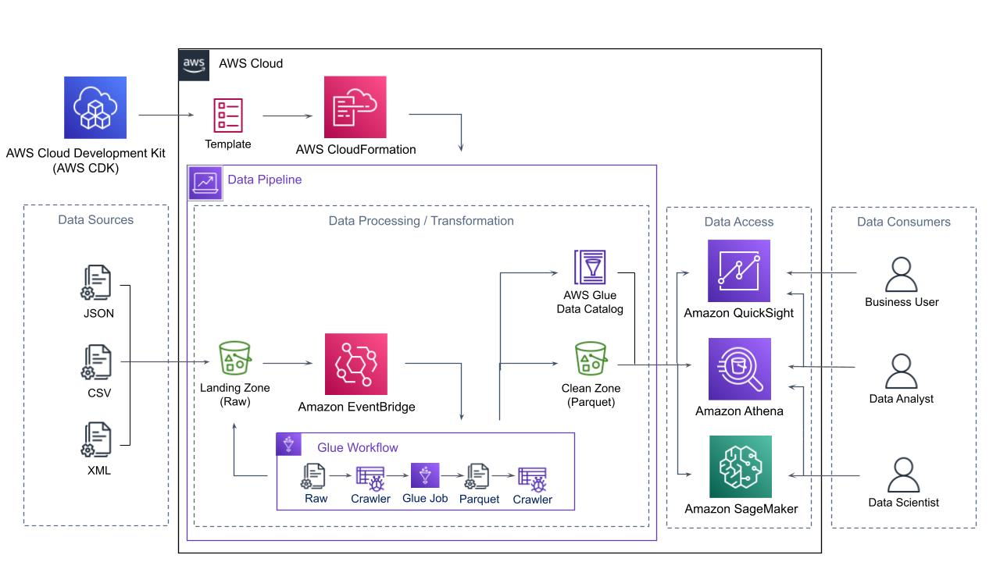

# Cloud Development Kit ETL Pipeline.
{: .fs-9 }

Just the Docs gives your documentation a jumpstart with a responsive Jekyll theme that is easily customizable and hosted on GitHub Pages.
{: .fs-6 .fw-300 }

[Get started now](#getting-started){: .btn .btn-primary .fs-5 .mb-4 .mb-md-0 .mr-2 } [View it on GitHub](https://github.com/just-the-docs/just-the-docs){: .btn .fs-5 .mb-4 .mb-md-0 }

---

## Project

## Features

## Installation

### Useful commands

* `npm run build`   compile typescript to js
* `npm run watch`   watch for changes and compile
* `npm run test`    perform the jest unit tests
* `cdk deploy`      deploy this stack to your default AWS account/region
* `cdk diff`        compare deployed stack with current state
* `cdk synth`       emits the synthesized CloudFormation template

## About

